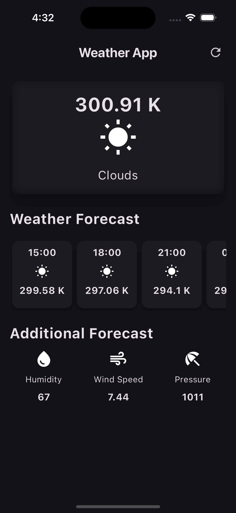

# Weather App



## Description

This is a simple weather app built with Flutter. It provides current weather information as well as hourly forecasts.

## Features

- Current weather information
- Hourly weather forecast
- Additional weather details

## Installation

To run this project, you'll need to have Flutter installed on your computer. After that, you can clone this repository and run the app on your local machine.

```bash
git clone https://github.com/lavkushry/Weather-App-Flutter.git
cd weather_app
flutter run

Usage
Provide instructions on how to use your app.

Contributing
Pull requests are welcome. For major changes, please open an issue first to discuss what you would like to change.